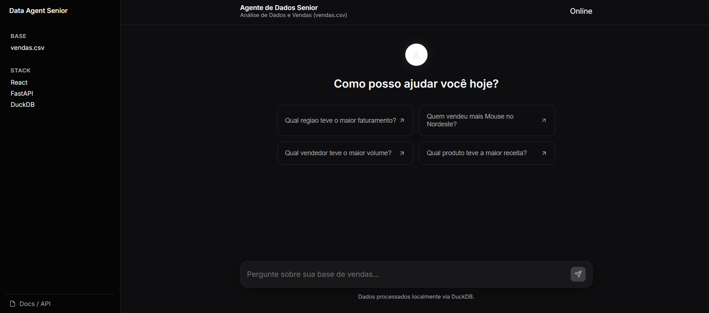
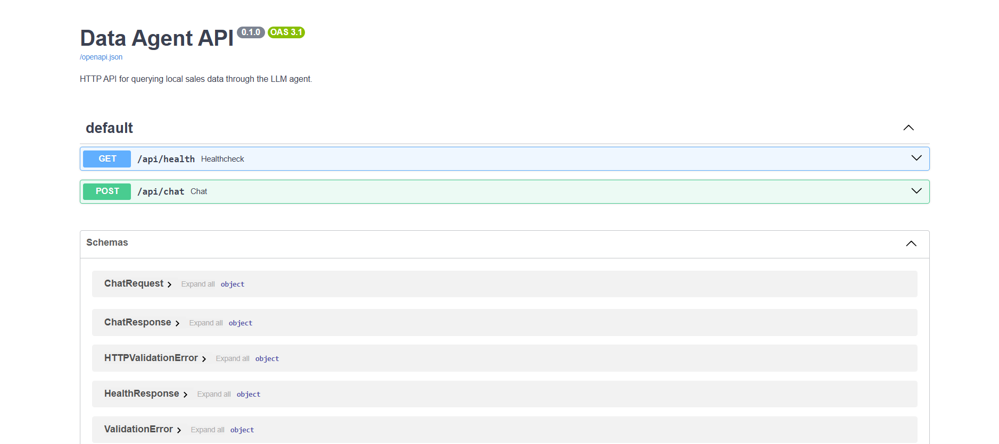

# Data Agent Senior

Data Agent Senior is a local analytics assistant that translates natural language questions into analytical queries over CSV-based sales data. The project combines a React frontend, a FastAPI backend, DuckDB for local OLAP execution, and a LangChain-based agent orchestrated with Groq-hosted models.

The repository is structured to keep the analytical engine in Python while exposing a product-oriented chat interface in the browser. This separation makes the system easier to evolve from both a UX and backend perspective.

## Overview

The current implementation is designed for local-first analytical workflows:

- React + Vite provide the chat-oriented user interface.
- FastAPI exposes a simple HTTP contract for health checks and chat requests.
- DuckDB executes local analytical queries directly on CSV files.
- LangChain orchestrates the model, the SQL tools, and the execution flow.
- Groq provides the hosted LLM used to reason over the available schema and generate answers.

## System Architecture

The request lifecycle is intentionally simple:

1. A user submits a question in the React frontend.
2. The frontend sends a `POST /api/chat` request to the FastAPI backend.
3. The backend loads the agent once per process using `lru_cache`.
4. The LangChain agent inspects the available tables and generates the required SQL.
5. DuckDB executes read-only analytical queries over the local datasets.
6. The final answer is returned through the API and rendered in the chat UI.

This architecture preserves a clean boundary between presentation and analytical execution while keeping the project lightweight enough for local development.

## Key Capabilities

- Natural language analytical queries over local CSV data
- Read-only SQL execution against DuckDB
- Dedicated health and chat endpoints for frontend integration
- Product-style React interface with operational side context
- Process-scoped DuckDB runtime database to avoid file lock conflicts during execution

## User Interface

The frontend is a compact chat workspace focused on analytical interactions.



## API Surface

The backend exposes a minimal HTTP API intended for local development and UI integration.



### Endpoints

`GET /api/health`

- Returns service health information
- Useful for frontend connectivity checks

`POST /api/chat`

- Accepts a natural language message
- Returns the synthesized analytical answer from the agent

### Request Example

```json
{
  "message": "Qual produto teve a maior receita?"
}
```

### Response Example

```json
{
  "answer": "O produto com maior receita foi Monitor, com faturamento total de ..."
}
```

## Repository Structure

```text
data-agent-llm/
├── data/
│   └── sample/
│       └── vendas.csv
├── docs/
│   ├── architecture.md
│   ├── testing.md
│   └── images/
│       ├── api-reference.png
│       └── frontend-overview.png
├── frontend/
│   ├── src/
│   │   ├── App.jsx
│   │   ├── main.jsx
│   │   └── styles.css
│   ├── index.html
│   ├── package.json
│   └── vite.config.js
├── src/
│   ├── agent/
│   │   └── executor.py
│   └── main.py
├── requirements.txt
└── README.md
```

## Technology Stack

### Frontend

- React 18
- Vite
- Plain CSS for layout and visual system control

### Backend

- FastAPI
- Uvicorn
- Pydantic

### Analytical Layer

- DuckDB
- LangChain
- Groq
- Python dotenv

## Local Development

### 1. Backend setup

```powershell
.\venv\Scripts\activate
python -m pip install -r requirements.txt
```

### 2. Frontend setup

```powershell
cd frontend
npm install
cd ..
```

### 3. Environment configuration

Create a `.env` file in the project root based on `.env.example`:

```dotenv
GROQ_API_KEY=your_groq_api_key
GROQ_MODEL=llama-3.3-70b-versatile
LANGCHAIN_VERBOSE=false
```

### 4. Start the backend

```powershell
.\venv\Scripts\python.exe -m uvicorn src.main:app --reload
```

The API will be available at:

- `http://127.0.0.1:8000`
- `http://127.0.0.1:8000/docs`
- `http://127.0.0.1:8000/api/health`

### 5. Start the frontend

In another terminal:

```powershell
cd frontend
npm run dev
```

The frontend will be available at:

- `http://localhost:5173`

## Data Model Assumptions

The sample dataset is located at `data/sample/vendas.csv` and includes columns related to:

- order identifiers
- dates
- regions
- sellers
- products
- quantities
- unit prices

The current business rule used by the agent is:

- revenue or faturamento = `SUM(quantidade * valor_unitario)`

This rule is enforced at the prompt/tooling layer because the dataset does not provide a precomputed revenue column.

## Validation

Backend syntax can be validated with:

```powershell
python -m py_compile src\main.py src\__init__.py src\agent\__init__.py src\agent\executor.py
```

## Notes and Operational Considerations

- The backend enables local CORS for `localhost` and `127.0.0.1` to support the Vite development server.
- The analytical runtime uses a process-specific DuckDB database under `.runtime/` to avoid file lock conflicts.
- The project depends on outbound connectivity to Groq in order to complete LLM-backed requests.
- If the chat UI is online but answers fail, verify network access to Groq and the configured API key.

## Suggested Questions

- Quem vendeu mais Mouse no Nordeste?
- Qual vendedor teve o maior volume total?
- Qual produto teve a maior receita?
- Qual regiao teve o maior faturamento?
